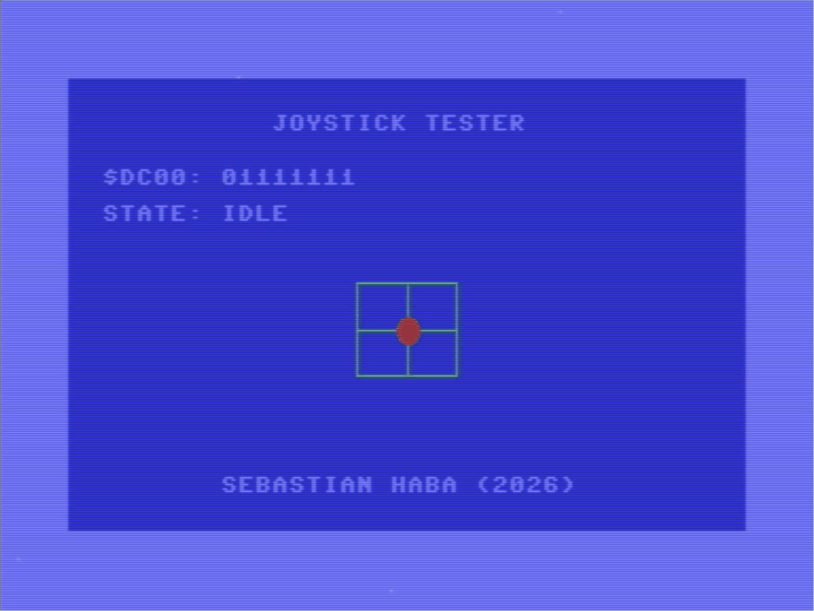

# C64 Joystick Tester

A Commodore 64 joystick tester application written in **C** using [oscar64](https://github.com/drmortalwombat/oscar64/).



---

## Description

This project tests the functionality of a joystick connected to **port 2** of the Commodore 64. The application reads the joystick state directly from the CIA chip's RAM memory address and presents the data in three different ways:

- 📝 **Text display** — human-readable labels showing the current state of each joystick direction and the fire button
- 🔢 **Binary display** — raw binary value read directly from the memory address (CIA1, `$DC00`), showing each bit corresponding to a joystick input
- 🕹️ **Graphical display** — a visual representation of the joystick state showing active directions and the fire button in real time

---

## Purpose

This is a **learning project** — part of my journey into programming on the Commodore 64. The goal was to practice reading hardware registers, manipulating memory, and rendering output on screen.

---

## Requirements

- Commodore 64 (real hardware or emulator, e.g. [VICE](https://vice-emu.sourceforge.io/))
- [oscar64](https://github.com/drmortalwombat/oscar64/) to compile the source code
- A joystick connected to **port 2**

---

## How it works

The joystick connected to port 2 is read from the CIA1 chip register at memory address **`$DC00`**. Each bit of this byte represents a direction or action:

| Bit | Direction / Action |
|-----|--------------------|
| 0   | Up                 |
| 1   | Down               |
| 2   | Left               |
| 3   | Right              |
| 4   | Fire               |

A bit value of `0` means the direction/button is **active** (pressed), and `1` means **inactive**.

---

## Project Structure

```
c64_joystick_tester/
├── src/                  # Assembly source code
├── assets/
│   └── doc/
│       └── 1.gif         # Demo animation
├── project-config.json   # Project configuration
└── .vscode/              # VS Code settings
```

---

## Author

**sebastianhaba**